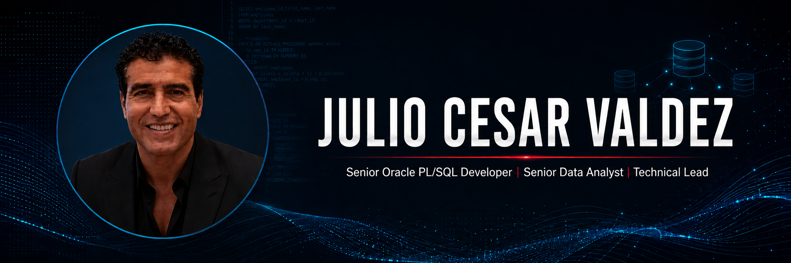

  

  
  
  

  

---

## About Me

Oracle PL/SQL Developer and Technical Lead with more than 20 years of experience building and optimizing mission-critical data solutions. I enjoy investigating new technologies, solving complex database challenges, automating processes, and transforming large volumes of information into useful business insights.

- Experienced in designing, developing, optimizing, and supporting enterprise Oracle solutions.
- Skilled in processing and analyzing high-volume data in business-critical environments.
- Strong background in technical leadership, troubleshooting, performance tuning, and process automation.
- Experienced in remote collaboration, cross-functional communication, and delivering reliable solutions.
- Expanding my data analytics expertise through Python, Power BI, statistical analysis, and business-focused projects.
- Based in Monterrey, Nuevo León, Mexico.

## Core Expertise

- **Oracle Development:** PL/SQL packages, procedures, functions, triggers, views, materialized views, partitioned tables, subpartitions, indexes, database links, and bulk processing.
- **Performance & Reliability:** SQL tuning, execution-plan analysis, statistics, query optimization, troubleshooting, and high-volume data processing.
- **Automation & Integration:** Korn Shell, Pro*C, flat files, SFTP/FTP transfers, scheduled jobs, reporting workflows, and system integrations.
- **Data Analytics:** SQL, Python, Pandas, NumPy, Matplotlib, Seaborn, Power BI, Excel, KPI development, dashboards, cohort analysis, funnels, and A/B testing.
- **Leadership:** Technical guidance, project coordination, incident resolution, requirements analysis, mentoring, and collaboration with business stakeholders.

## Technologies & Tools

  
  
  
  
  
  
  
  
  
  

## Professional Highlights

- Processed and optimized mission-critical telecommunications data environments handling billions of records.
- Contributed to the consolidation of data and operations across Axtel, Alestra, and Avantel.
- Developed automation and integration workflows that generated files and reports and securely transferred them between servers.
- Restored critical Oracle, C++, Pro*C, and Korn Shell components during high-impact production incidents.
- Built analytical projects involving dashboards, conversion funnels, cohort retention, A/B testing, and financial KPIs.

## Current Focus

I am currently focused on opportunities where I can combine deep Oracle PL/SQL expertise, technical leadership, and data analytics to improve performance, automate processes, and support better business decisions.

## GitHub Activity

  

---

  <strong>Let's connect and build reliable, data-driven solutions.</strong>

